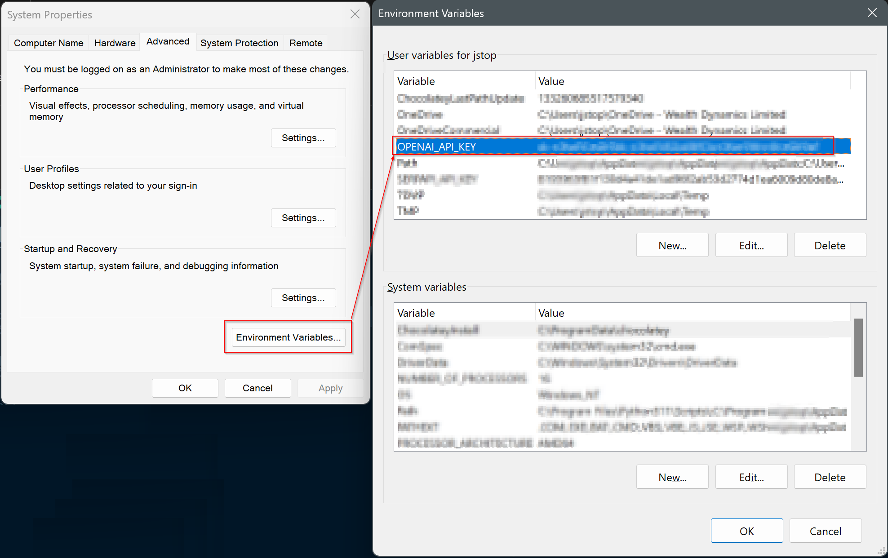

## How to setup the environment locally

1. Install Python 

2. Install VScode and the Python extension (https://marketplace.visualstudio.com/items?itemName=ms-python.python)

3. Clone repo in your local machine 

```bash
git clone https://github.com/jstoppa/gpthackathon.git
```

4. Navigate to the folder 
```bash
cd gpthackathon
```

5. Create virtual machine 
```bash
python -m venv .
```

6. Create an environment variable called OPENAI_API_KEY and enter the API key from the OpenAI website (you can obtain them from https://platform.openai.com/account/api-keys)
  

7. Open the repo in VSCode and run the file OpenAI/openai_hello_world.py to get the virtual machine started, it will most likely throw an error saying it can't find the openai package

8. Install all packages needed by running the command below using the terminal inside VSCode
```bash
pip install -r requirements.txt
```
